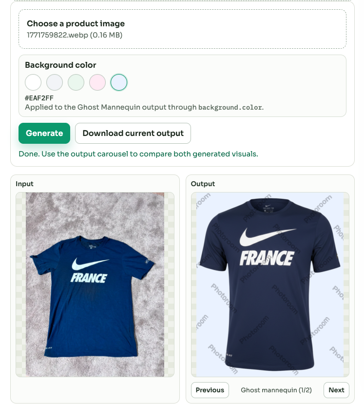
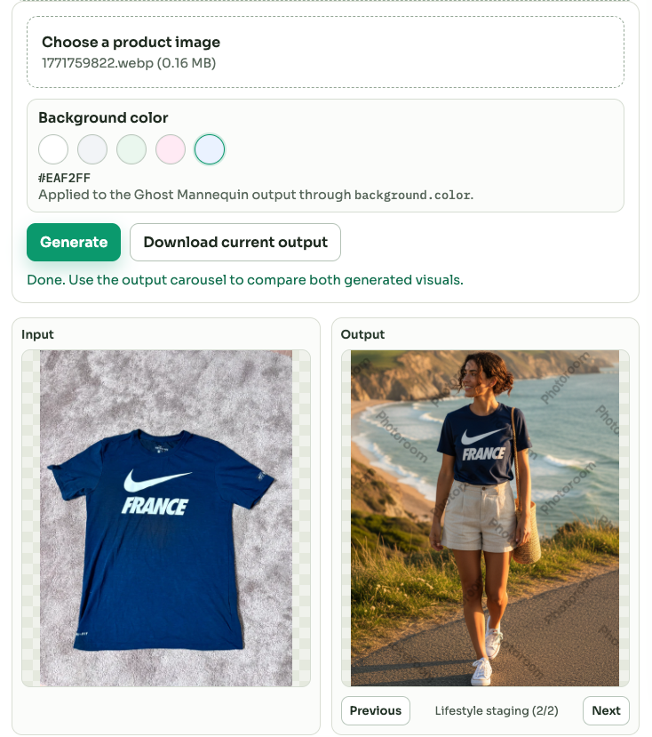

# Photoroom API Playground

[](https://github.com/emirbelkahia/photoroom-api-playground/actions/workflows/ci.yml)
[](LICENSE)
[](https://github.com/emirbelkahia/photoroom-api-playground/tags)

This folder contains a minimal web demo with two clear modes:

1. `Remove background` using `POST /v1/segment`
2. `Advanced mode` using `POST /v2/edit` to generate two outputs from one input image:
   - Ghost mannequin on a controlled light background color
   - Lifestyle staging visual

## Setup

```bash
cd tech
python3 -m venv venv
source venv/bin/activate
pip install -r requirements.txt
cp .env.example .env
```

Set `PHOTOROOM_API_KEY` in `.env`.

- Sandbox usage is enforced by default: `PHOTOROOM_REQUIRE_SANDBOX=true`
- Sandbox keys should start with `sandbox_`
- This demo was built and tested with a sandbox key.

## Run

```bash
uvicorn app.server:app --reload --host 127.0.0.1 --port 8000
```

Open `http://127.0.0.1:8000`.

## Demo behavior

- Tab 1 generates a transparent cutout from a single input image.
- Tab 2 runs two advanced generations from one uploaded image:
  - Pass 1: `output_variant=ghost_mannequin` + `background.color` from fixed light swatches (controlled solid background)
  - Pass 2: `output_variant=lifestyle_staging` (natural scene background, no cutout)
- Advanced results are shown as:
  - `Input` card (uploaded image)
  - `Output` card with a carousel (2 outputs today)

## Example outputs

Ghost mannequin output:



Lifestyle output:



## Why this project

- Learn the practical capabilities of Photoroom APIs through a realistic business workflow instead of isolated endpoint tests.
- Build an educational but potentially useful demo for small e-commerce apparel teams.
- Keep the implementation intentionally minimal and explainable while covering two real output needs:
  - catalog-oriented product visual
  - lifestyle-oriented marketing visual
- Use FastAPI because it is lightweight, quick to iterate, easy to read in public repos, and provides a clean API proxy layer for frontend demos.

## Official Photoroom documentation

- Photoroom API overview: https://www.photoroom.com/api/
- API reference (OpenAPI): https://docs.photoroom.com/getting-started/api-reference-openapi
- Remove background quickstart: https://docs.photoroom.com/remove-background-api-basic-plan
- Describe Any Change: https://docs.photoroom.com/image-editing-api-plus-plan/alpha-describe-any-change
- Positioning options: https://docs.photoroom.com/image-editing-api-plus-plan/positioning
- Photoroom GitHub organization: https://github.com/Photoroom

## Prompt management

Prompts are editable in files, not hardcoded in UI logic:

- `app/prompts/ghost_mannequin.txt`
- `app/prompts/lifestyle_staging.txt`

The backend loads these files at request time and falls back to internal defaults if a file is empty or missing.

## Local endpoints

- `POST /api/remove-bg`
- `POST /api/advanced-edit`
- `GET /api/demo-info` (runtime config + Photoroom documentation links)

## Upload limits and formats

- Global upload limit: `APP_MAX_UPLOAD_BYTES` (default `10 MB`)
- Remove mode: PNG, JPG/JPEG, WEBP, HEIC/HEIF
- Advanced mode (`/v2/edit`): PNG, JPG/JPEG, WEBP (HEIC/HEIF rejected)

## Notes

- Advanced mode is intentionally constrained to stay explainable and stable in public demos.
- Outputs are generated as PNG (`PHOTOROOM_ADVANCED_EXPORT_FORMAT=png` by default).

## Limitations

- HEIC/HEIF is supported in remove mode but not in advanced mode (`/v2/edit`) because this codebase does not implement input conversion.
- The demo is sandbox-first by design and validated with sandbox keys only.
- No billing/production setup is included at this stage because the project focus is learning and workflow validation.

## License

MIT (`LICENSE`).
